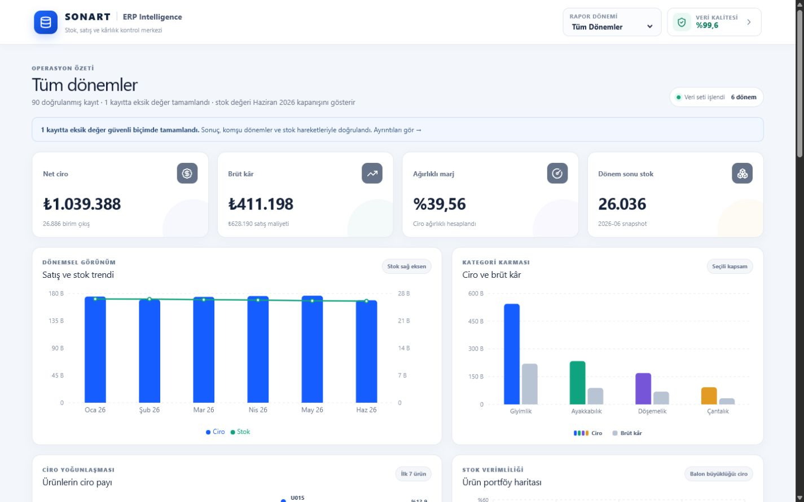
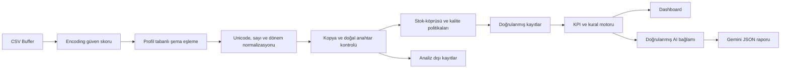
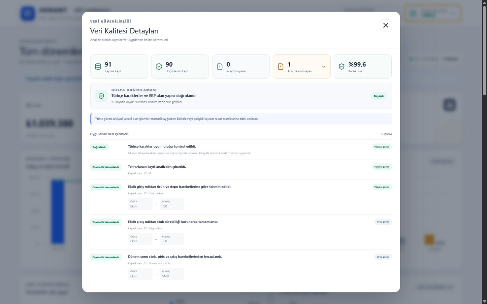
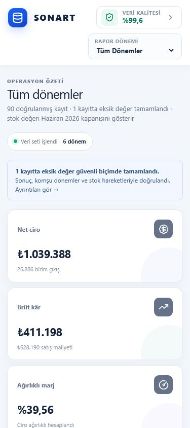

# Sonart AI-Vision Basic

Sonart AI-Vision Basic, Logo Netsis benzeri çok dönemli stok ve satış CSV'lerini yönetim kararına dönüştüren Track B uygulamasıdır. Sistem veri kalitesi sorunlarını analizden önce görünür biçimde ele alır; ciro, kârlılık, stok ve ürün performansını seçilen rapor kapsamına göre hesaplar. Dashboard, açıklanabilir kural sinyallerini ürün ve depo ayrıntılarıyla sunarken Gemini doğrulanmış metriklerden yönetici değerlendirmesi ve kanıta dayalı aksiyon planları üretir. Kullanıcı dönem seçimini değiştirdiğinde analitik sonuçlar, riskler ve AI raporu aynı zaman kapsamına göre yeniden oluşturulur.



## Proje bağlantıları

- **Canlı uygulama:** [sonartvision.vercel.app](https://sonartvision.vercel.app)
- **Kaynak kod:** [github.com/AhmeTpz/SONART-Track-B](https://github.com/AhmeTpz/SONART-Track-B)
- **Ekran kaydı:** 1–2 dakikalık video bağlantısı teslim öncesinde eklenecektir.

## Track B tercihi ve problem kapsamı

Track B'yi veri mühendisliği, zaman serisi analizi, açıklanabilir iş kuralları ve AI destekli yönetim raporlamasını aynı iş probleminde birleştirdiği için seçtim. ERP raporundaki eksik, kopya veya hatalı bir kayıt stok, maliyet ve kârlılık yorumunu doğrudan etkileyebildiğinden çözümü yalnız demo CSV'yi görselleştiren bir ekran olarak değil, farklı ürün, depo ve dönem sayılarını aynı kurallarla işleyebilen profil tabanlı bir yapı olarak tasarladım. Veri işleme ve analitik kararları; ürün koduna, kaynak satır numarasına veya sabit dönem sayısına bağlı olmayan, sürümlü `ReportProfile` politikaları üzerine kuruldu.

Uygulama bu teslimde stok-satış rapor profilini uygular. Aynı çekirdek; farklı kolon, doğal anahtar, veri tipi, kalite politikası ve risk eşikleri tanımlayan yeni profillerle diğer departman raporlarına genişletilebilir.

## Çözüm kapsamı

- Veriden dinamik çıkarılan dönemler ile tek ay ve `Tüm Dönemler` görünümleri
- Ciro, brüt kâr, ciro ağırlıklı marj, satış miktarı ve kapanış stoku KPI'ları
- Satış/stok trendi, kategori performansı, ürün ciro payı ve stok verimliliği grafikleri
- Tüm portföy özeti ile ürün/depo bazında ayrıntılı dönem analizi
- Kritik stok, yavaş/hareketsiz stok, düşük marj, marj daralması ve maliyet artışı sinyalleri
- Encoding, Türkçe karakter, şema, kopya, doğal anahtar, sınır değer ve eksik dönem kontrolleri
- Kontrollü stok-köprüsü çıkarımı ve alan bazında veri işlem geçmişi
- Gemini ile yapılandırılmış yönetici değerlendirmesi ve 2–4 maddelik öncelikli aksiyon planı
- Responsive arayüz ve grafiklerin kesin değer tablolarıyla desteklendiği A4 yatay PDF görünümü

## Teknoloji ve mimari kararlar

| Teknoloji | Kullanım gerekçesi |
| --- | --- |
| Next.js 16, React ve TypeScript | Arayüzü, sunucu API route'unu ve ortak veri sözleşmelerini tip güvenli tek projede yönetmek |
| Tailwind CSS ve uygulama CSS'i | Responsive dashboard ile baskı/PDF düzenini aynı görsel sistemde uygulamak |
| PapaParse ve iconv-lite | Quoted CSV alanlarını ve farklı Türkçe encoding seçeneklerini güvenli biçimde işlemek |
| Recharts | Dönemsel, kategorik ve ürün bazlı metrikleri responsive SVG grafiklerle sunmak |
| Gemini API | Doğrulanmış analitik bağlamdan Türkçe ve yapılandırılmış yönetim çıktısı üretmek |
| Zod | API isteğini ve model cevabını çalışma anında doğrulamak |
| Vitest | Veri işleme, analitik ve AI sözleşmesini sentetik edge-case'lerle doğrulamak |

Frontend, veri işleme çekirdeği ve AI endpoint'i aynı Next.js uygulamasında bulunur. Gemini anahtarı yalnız sunucu tarafındaki `POST /api/analyze` route'unda okunur; tarayıcıya veya istemci paketine aktarılmaz.

## AI model seçimi ve alternatif değerlendirmesi

Birincil model olarak kararlı sürüm `gemini-3.5-flash-lite` seçildi. Google bu modeli düşük gecikme, yüksek hacimli veri işleme ve yapılandırılmış çıktı gerektiren iş yükleri için konumlandırmaktadır. Uygulamanın ihtiyacı da ham veride serbest muhakeme yapmak değil; deterministik olarak hazırlanmış ERP özetini JSON şemasına uygun, hızlı ve düşük maliyetli bir yönetim raporuna dönüştürmektir.

| Model | Değerlendirme | Karar |
| --- | --- | --- |
| `gemini-3.5-flash-lite` | Düşük gecikme, yüksek işlem hacmi, yapılandırılmış çıktı desteği ve 1 milyon token bağlam penceresi; standart ücrette 1 milyon token için 0,30 USD girdi / 2,50 USD çıktı | Uygulamanın kısa ve yapılandırılmış ERP raporlama iş yükü için birincil model |
| `gemini-3.6-flash` | Karmaşık araç kullanımı ve çok modlu görevlerde daha güçlü; standart ücrette 1 milyon token için 1,50 USD girdi / 7,50 USD çıktı | Bu akışta hesapları kural motoru yaptığı için ek kapasite ve maliyet gerekli görülmedi |
| `gemini-3.5-flash` | Uzun süreli muhakeme ve araç kullanan işlerde daha yetenekli; standart ücrette 1 milyon token için 1,50 USD girdi / 9,00 USD çıktı | Doğrulanmış bağlamdan rapor üretimi için gereğinden yüksek maliyetli |
| `gemini-3.1-flash-lite` | Daha eski fakat kararlı ve düşük maliyetli Flash-Lite seçeneği | Birincil model bulunamadığında devreye giren kontrollü yedek model |

Model bulunamadı hatası dışındaki timeout, yetkilendirme veya geçersiz cevap durumlarında farklı modele sessizce geçilmez; hata kullanıcıya gösterilir. Model özellikleri ve fiyat karşılaştırması 30 Temmuz 2026 tarihli resmî [Gemini model kataloğu](https://ai.google.dev/gemini-api/docs/models), [güncel model rehberi](https://ai.google.dev/gemini-api/docs/latest-model) ve [Gemini API fiyatlandırması](https://ai.google.dev/gemini-api/docs/pricing) temel alınarak hazırlanmıştır.

## Veri işleme ve kalite mimarisi



CSV önce metne çevrilmek yerine `Buffer` olarak okunur. BOM kontrolünden sonra UTF-8, Windows-1254 ve ISO-8859-9 adayları; geçersiz byte, replacement/control karakteri, mojibake örüntüsü, Türkçe karakter tutarlılığı ve ERP başlık eşleşmesiyle puanlanır. Yeterli güven farkı yoksa encoding tahmin edilmez.

Doğal kayıt anahtarı `stok_kodu + depo + dönem` olduğu için aynı ürünün farklı depolardaki kayıtları korunur. Tam kopyalar içerik hash'iyle kaldırılır; aynı doğal anahtardaki çelişkili içerikler otomatik seçilmeden analiz dışında tutulur. Negatif hareket, stok, maliyet veya fiyat değerleri bu ERP profilinde geçersizdir. Ürün adı ya da kategori dönemler arasında değişirse veri otomatik değiştirilmez ve `MASTER_DATA_DRIFT` uyarısı üretilir.

Eksik stok değeri iki ayın ortalaması alınarak doldurulmaz. Motor, ürün-depo zaman serisindeki giriş/çıkış eğilimini yalnız başlangıç tahmini olarak kullanır; önceki ve sonraki doğrulanmış stoklar arasındaki zorunlu net hareketi hesaplar ve eksik akışları stok denge denklemine göre uzlaştırır. Ara stok `önceki stok + giriş − çıkış` denklemiyle türetilir. Takvim komşuluğu, varyasyon ve mutabakat sınırları sağlanmıyorsa değer üretilmez. Her otomatik değişiklik kaynak satır, alan, yöntem, önce/sonra değeri ve güven seviyesiyle veri işlem geçmişine kaydedilir.



## Dönemsel analitik sözleşmesi

- Tek ay görünümünde akış metrikleri yalnız seçili aya aittir.
- Tek ay stok kapsamı, seçili ayın çıkış miktarı ve seçili ay kapanış stokuyla hesaplanır.
- Tek ay maliyet ve marj değişimi yalnız gerçek takvimdeki bir önceki bitişik ayla karşılaştırılır.
- `Tüm Dönemler` görünümünde ciro, satış maliyeti, brüt kâr ve satış miktarı tarih aralığı boyunca toplanır.
- Stok bir akış değil kapanış fotoğrafıdır; yalnız son gerçek dönemin stok değeri kullanılır.
- Tüm dönemler stok kapsamı, tarih aralığındaki geçerli aylık kayıtların ortalama satış hızı ile son dönem stokunu birleştirir.
- Tüm dönemler maliyet ve marj değişimi yalnız raporun gerçek ilk ve son dönemlerinde kaydı bulunan ürünler için ilk–son karşılaştırmasıyla hesaplanır.
- Son dönem ürün/depo kapsamı eksikse eski stok yeni aya taşınmaz ve kullanıcıya `INCOMPLETE_LATEST_PERIOD` uyarısı gösterilir.

## Açıklanabilir risk motoru

Temel metrikler ve profil eşikleri:

- Ciro = çıkış miktarı × birim satış fiyatı
- Satış maliyeti = çıkış miktarı × birim maliyet
- Brüt kâr = ciro − satış maliyeti
- Ağırlıklı marj = toplam brüt kâr / toplam ciro
- Kritik stok = sıfır stok veya `< 0,5 ay` stok kapsamı
- Yavaş/hareketsiz stok = `> 6 ay` kapsam veya satışsız pozitif stok
- Düşük marj = `< %25`
- Marj daralması = ilgili karşılaştırma kapsamına göre `≥ 5 yüzde puan`
- Maliyet artışı = ilgili karşılaştırma kapsamına göre `≥ %10`

Riskler AI tarafından değil, sürümlü [`ReportProfile`](lib/types.ts) eşiklerinden deterministik olarak üretilir. Kritik stok kapsamı hesaplanabildiğinde aynı ürün için ayrıca birim bazlı düşük stok sinyali açılmaz. `Tüm Dönemler` görünümünde aynı ürün/risk türü aylara göre tekrarlanmaz; sinyal bütün tarih aralığının tanımlı hesaplama kapsamını temsil eder.

## AI raporlama sözleşmesi

API yalnız `{ "scope": "ALL" | "YYYY-MM" }` isteğini kabul eder ve dönem değerini temiz veri kümesine göre doğrular. Ham CSV modele gönderilmez. Gemini bağlamı; deterministik KPI'lar, dönem karşılaştırmaları, kategori ve ürün katkıları, portföy yoğunlaşması, kural sinyalleri ve veri kalite özetinden oluşturulur.

Tek ay ve tüm dönemler için ayrı görev promptları kullanılır. Kural motoru sinyalleri üç bağımsız karar alanına dönüştürür: arz sürekliliği, stok verimliliği ve kârlılık kontrolü. Model, bağlamda bulunan her karar alanı için ayrı aksiyon üretmek zorundadır; aynı karar alanındaki birden fazla ürün tek aksiyonda birleştirilebilir.

Model çıktısı JSON Schema ve Zod ile doğrulanır. Aksiyon hedefleri, ürün kodları ve ürün bazlı kanıtlar arasında tutarlılık aranır; hedefte bulunmayan bir ürün koduna ait kanıt veya zorunlu karar alanlarından daha az aksiyon içeren cevap kabul edilmez. Başarılı raporlar `dataVersion + kapsam` anahtarıyla tarayıcı oturumunda saklanır; veri veya profil sürümü değiştiğinde eski rapor kullanılmaz.

## Kurulum ve çalıştırma

Gereksinimler: Node.js 22–24, npm ve geçerli bir Gemini API anahtarı.

```bash
git clone https://github.com/AhmeTpz/SONART-Track-B.git
cd SONART-Track-B
npm install
```

`.env.example` dosyasını `.env.local` olarak kopyalayıp anahtarı ekleyin:

```env
GEMINI_API_KEY=your_api_key_here
```

```bash
npm run dev
```

Uygulama `http://localhost:3000` adresinde açılır. `.env.local` Git'e dahil edilmez.

## Temel mühendislik zorluğu

En zor teknik karar, eksik giriş/çıkış/stok değerlerini görsel olarak makul fakat stok denklemine aykırı bir sonuç üretmeden tamamlamaktı. Akış ölçülerini birbirinden bağımsız doğrusal interpolasyonla doldurmak stok sürekliliğini bozabildiğinden, tahmin ile fiziksel stok denklemini birlikte kullanan stok-köprüsünü geliştirdim. Otomatik işlem yalnız profilin istikrar, takvim komşuluğu ve mutabakat koşulları sağlandığında uygulanır; belirsiz durumda kayıt değiştirilmez.

## Ölçeklenebilirlik ve üretim ortamı yol haritası

300+ departman raporu hedefinde ingestion çekirdeğini kopyalamak yerine her rapor ailesi için kanonik alanları, alias'ları, doğal anahtarı, eksik değer politikalarını, master-data kurallarını ve risk eşiklerini tanımlayan yeni bir `ReportProfile` eklenir. Ürün kodları, dönemler veya demo satır numaraları üretim kararlarına koşul olarak yazılmaz.

Üretim ortamında planlanan başlıca geliştirmeler:

- CSV yüklemelerini object storage ve kuyruk tabanlı ingestion işlerine taşımak
- Temiz kayıtları, analiz dışı satırları ve lineage bilgisini sürümlü bir veri tabanında saklamak
- Şirket/departman bazlı RBAC, SSO, tenant ayrımı ve veri maskeleme uygulamak
- Büyük dosyalar için streaming parse, parça bazlı işleme ve idempotent job tasarlamak
- Profil ve master-data sözlüklerini yönetilebilir bir konfigürasyon servisine taşımak
- AI çağrılarına merkezi cache, rate limit, maliyet bütçesi ve düzenli kalite değerlendirme setleri eklemek
- Log, metrik ve alarm akışını merkezi gözlemlenebilirlik altyapısına bağlamak

## Doğrulama kapsamı

```bash
npm test
npm run lint
npm run build
```

Son doğrulamada 76 testin tamamı, lint ve production build başarılıdır. Test kapsamı; 3/6/7/12 dönem, farklı SKU/depo adları, çoklu depo, birebir ve çelişkili kopya, negatif/sınır değerler, UTF-8/Windows-1254/ISO-8859-9, mojibake, NFC/NFD, görünmez karakter, kısa/uç/uzun eksik değer senaryoları, kısmi son dönem, ilk–son dönem karşılaştırması, 50.000 satır performans testi ve AI/API hata durumlarını içerir.

Demo CSV yalnız regresyon fixture'ı olarak kullanılır: 91 ham kayıttan 90 doğrulanmış kayıt, 1 birebir kopya ve 3 stok-köprüsü alan işlemi beklenir. Bu SKU, satır ve KPI değerleri üretim kurallarında kullanılmaz.



## Mevcut kapsam sınırları

- Veri kaynağı deployment içindeki demo CSV'dir; kullanıcı dosya yükleme ve canlı ERP senkronizasyonu bu teslimin kapsamında değildir.
- Yeni CSV içeriğinin kullanılabilmesi için yeni build/deployment gerekir.
- AI raporu için sunucu tarafında `GEMINI_API_KEY` bulunmalıdır.
- AI cache'i tarayıcı oturumu bazlıdır; dağıtık kalıcı cache kullanılmaz.
- PDF çıktısı tarayıcının yazdırma/PDF altyapısını kullanır.
- Veri üzerinde serbest soru-cevap arayüzü bonus kapsam dışında bırakılmıştır.
